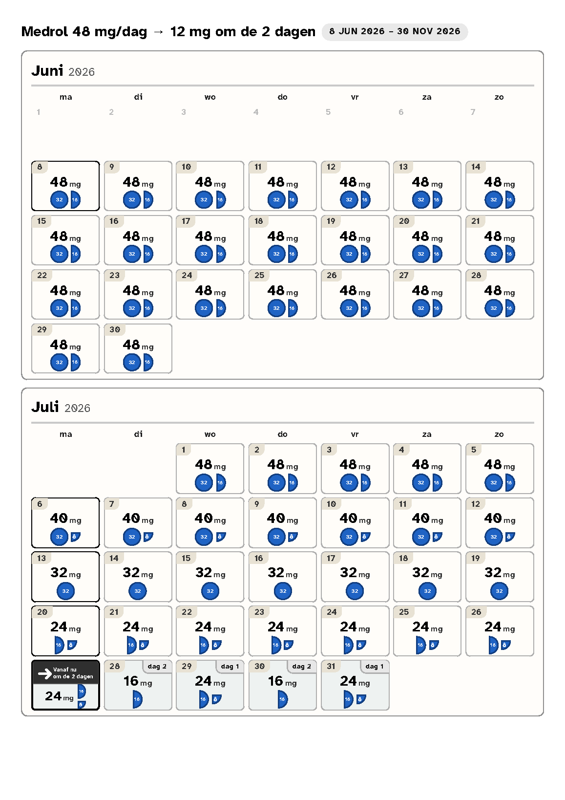

# Medrol tapering calendar

A single self-contained HTML file that turns a Medrol (methylprednisolone)
tapering schedule into a large-print **calendar a patient can follow at a
glance** — then prints it on A4 to hand over in clinic.

Built for elderly / low-vision patients, in **Dutch, English and French**.



*Example output ([full colour PDF](medrol-taper-example.pdf)) — a 48 mg/day →
12 mg every-other-day taper. Two months per A4 sheet; the every-other-day switch
is banner-marked, and the maintenance dose (8 mg + 4 mg tablets) is drawn to
scale on each dose day.*

## For clinicians

1. Open **`medrol-taper.html`** in any web browser (double-click it — no install,
   works offline).
2. Pick a **schedule** and the patient's **start date**.
3. Adjust phases if needed in the editor on the left (duration, daily vs.
   every-other-day, dose per phase), and fill in the footer (extra medication,
   your contact details).
4. Click **🖶 Afdrukken / Print** and print to A4.

What the patient gets: one box per day showing the exact dose in mg, with the
tablets drawn to scale (so "how much today" is visible, not just a number), the
day the schedule switches to every-other-day clearly banner-marked, and a footer
listing any other medication plus who to contact.

It's designed to stay readable when printed in **black-and-white**, so any office
printer works.

### Saving your own schedules

The built-in schedules cover the common tapers. To keep a custom one, build it
in the editor and click **★ Save as schedule** — your browser downloads an
updated copy of `medrol-taper.html` with that schedule baked in. Replace your
file with the download (or share it with colleagues) to keep it.

## For developers

Everything lives in one file, `medrol-taper.html` — HTML, CSS and vanilla JS, no
build step and no dependencies (the only external asset is the Atkinson
Hyperlegible web font, which degrades gracefully to system fonts offline).

```
medrol-taper.html   the whole app
tests/              print-layout regression tests (Node's built-in test runner)
AGENTS.md           design constraints + architecture (read this before changing things)
```

Run the tests:

```
node --test tests/print-layout.test.mjs
```

**The deliverable is the printed page, not the screen.** Before merging any
change, check the browser print preview: 2 months per A4 sheet, nothing clipped,
footer on the last page, still legible in black-and-white. See
[`AGENTS.md`](AGENTS.md) for the full design rationale and the parts you must not
break.
